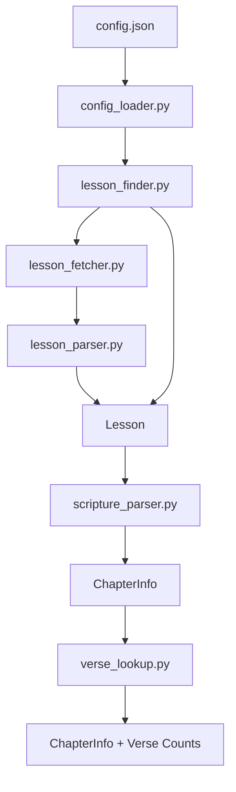

# Come, Follow Me AI Reminder

An automated system that generates and sends daily Come, Follow Me reading reminders.

The project combines deterministic code with AI:

- Code determines factual information.
- AI makes subjective decisions such as dividing readings and writing reminders.

---

# Current Progress

✅ Config

✅ Download HTML

✅ Parse lesson

✅ Find current lesson

✅ Parse scripture references

✅ Verse lookup

-------------------------

⬜ AI reading division

⬜ Reading validation

⬜ AI reminder generation

⬜ Weekly plan storage

⬜ SMS notifications

⬜ Weekly scheduler

# Current Project Structure



## main.py

Application entry point.

Currently used to test the various modules while the project is under development.

Eventually, this will start the weekly reminder generation pipeline.

---

## config.json

Stores user-editable configuration.

Currently includes:

- Come, Follow Me manual URLs
- Time zone
- Notification time

---

## config_loader.py

Loads configuration information.

Responsibilities:

- Read `config.json`
- Determine the correct manual URL
- Predict future manual URLs if the current year is not configured
- Verify predicted URLs exist

---

## models.py

Contains all project data models using Python dataclasses.

Current models:

- LessonWeek
- Lesson
- ChapterInfo
- DailyReading
- Reminder
- WeeklyPlan

The models are progressively enriched as they move through the pipeline.

For example:

Lesson

↓

ChapterInfo

↓

ChapterInfo (with verse counts)

These objects are passed between modules instead of using dictionaries.

---

## lesson_fetcher.py

Downloads lesson pages from the official Church website.

Responsibilities:

- Download HTML
- Report download failures

Does **not** parse any HTML.

---

## lesson_parser.py

Parses downloaded HTML into a `Lesson` object.

Responsibilities:

- Parse the lesson page title
- Extract:
  - Lesson week
  - Lesson title
  - Scripture assignment
- Convert lesson dates into `date` objects
- Return a populated `Lesson`

The parser is deterministic and does not rely on AI.

---

## lesson_finder.py

Determines the current week's lesson.

Responsibilities:

- Determine the current manual
- Download lesson pages
- Parse each lesson
- Compare the lesson week to today's date
- Return the current `Lesson`

---

## scripture_parser.py

Parses scripture assignments into structured chapter data.

Supports:

- Single chapters
- Consecutive chapter ranges
- Non-consecutive chapter ranges
- Multiple books
- Numbered books
- Long book names
- Introductory lessons with no scripture reading

Example:

```
Proverbs 1–4; 15–16; 22; 31; Ecclesiastes 1–3; 11–12
```

↓

```
Proverbs 1
Proverbs 2
Proverbs 3
Proverbs 4
Proverbs 15
Proverbs 16
Proverbs 22
Proverbs 31
Ecclesiastes 1
Ecclesiastes 2
Ecclesiastes 3
Ecclesiastes 11
Ecclesiastes 12
```

If a lesson contains no scripture reading (such as an introduction lesson), an empty chapter list is returned.

---

## utils.py

General helper functions used throughout the project.

Responsibilities:

- Parse Come, Follow Me lesson date ranges
- Build lesson URLs
- General helper functions shared across modules

---

## verse_lookup.py

Loads verse counts from a local JSON database.

Responsibilities:

- Load the verse-count dataset
- Populate each `ChapterInfo` with its verse count
- Validate that every referenced chapter exists

The verse-count JSON is considered the authoritative source.

---

## reading_divider.py

(Not yet implemented)

Uses AI to divide the week's reading into seven balanced daily assignments.

---

## reading_validator.py

(Not yet implemented)

Verifies AI-generated reading schedules.

Checks include:

- Exactly seven days
- No skipped verses
- No duplicate verses
- No invalid verses
- All verses accounted for

---

## reminder_generator.py

(Not yet implemented)

Uses AI to generate daily reading reminders.

---

## storage.py

(Not yet implemented)

Saves and loads generated weekly reading plans.

---

## notification.py

(Not yet implemented)

Sends the daily reminder using the selected notification service.

---

# Design Philosophy

The project follows one guiding principle:

> Objective truth comes from code. Subjective judgment comes from AI.

Deterministic code is responsible for:

- Current lesson selection
- Scripture assignments
- Chapter parsing
- Verse counts
- Validation
- URLs
- Data storage
- Notifications

AI is responsible for:

- Dividing weekly readings into daily assignments
- Writing personalized reminders
- Natural language generation

The AI is never treated as the source of factual scripture information.